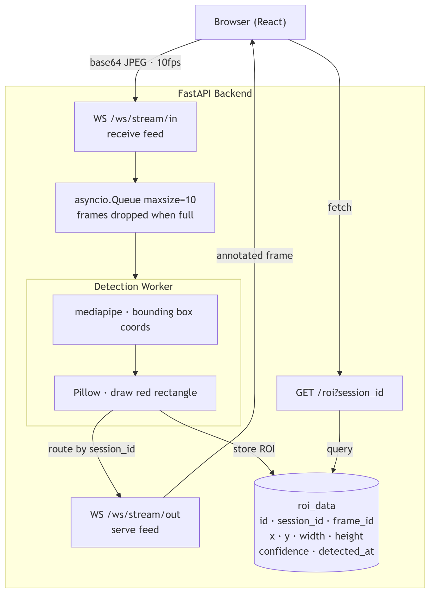

# Real-Time Face Detection Streaming System

## Overview

A containerised full-stack application that accepts a live webcam feed from the browser, detects a face in each frame using MediaPipe, draws an axis-aligned bounding box (ROI) on the frame using Pillow, stores the bounding box coordinates in PostgreSQL, and streams the annotated frames back to the browser in real time. 

The frontend is a React Single Page Application (SPA) with two main views:
1. **Live Stream Dashboard (`/`)**: Connects to the camera and streams video to the backend, displaying the real-time annotated output.
2. **ROI History Dashboard (`/roi`)**: Fetches and displays a list of all historical recording sessions and their corresponding database bounding-box metrics.

---

## Architecture




---

## Quick Start

```bash
git clone https://github.com/abhiram-karanth-core/real-time-face-detection-streaming-system.git
cd real-time-face-detection-streaming-system
docker compose up --build
```

- Frontend: http://localhost:3000
- Backend API docs: http://localhost:8000/docs


---

## Endpoints

| Endpoint Role | Method | Path | Description |
|---------------|--------|------|-------------|
| **1. Receive Video Feed** | `WS` | `/ws/stream/in` | Accepts raw base64 JPEG frames from the browser |
| **2. Serve Video Feed** | `WS` | `/ws/stream/out` | Returns annotated frames back to the frontend |
| **3. Serve ROI Data** | `GET` | `/roi` | Returns ROI bounding boxes (query by `?session_id=...` or list all) |

*(Note: An internal `/health` endpoint is also included strictly for Docker Compose liveness probes).*

### WebSocket protocol
- **`/ws/stream/in` (Client → Server):** raw base64-encoded JPEG string
- **`/ws/stream/out` (Server → Client):** `data:image/jpeg;base64,<annotated>` — dropped directly into ``

### GET /roi response
```json
{
  "session_id": "uuid",
  "count": 42,
  "roi": [
    {
      "id": 1,
      "session_id": "...",
      "frame_id": "...",
      "x": 120, "y": 80, "width": 200, "height": 240,
      "confidence": 0.97,
      "detected_at": "2024-01-01T12:00:00+00:00"
    }
  ]
}
```

---

## Design Decisions

**asyncio.Queue as frame buffer** — Lightweight in-process producer/consumer decoupling. The WebSocket receiver (producer) and the detection worker (consumer) run independently. When the queue is full, new frames are dropped rather than buffered — this keeps the pipeline real-time rather than falling behind.

**Separated Input/Output WebSockets** — Rather than multiplexing video upload and annotated-frame download over a single bidirectional pipe, the endpoints are cleanly separated (`/ws/stream/in` and `/ws/stream/out`). This strictly enforces the single-responsibility principle and aligns perfectly with the requirement for distinct "receive" and "serve" endpoints.

**10fps capture rate (100ms interval)** — The browser captures and sends a frame every 100ms. This rate is chosen to match backend processing capacity. The capture interval is a single constant (`CAPTURE_INTERVAL_MS`) — dropping it to 33ms gives smooth 30fps if deployed on hardware with more CPU headroom.

**Pillow for bounding box rendering** — To strictly adhere to the requirement of not using the OpenCV library, Pillow (`PIL`) was selected to draw the axis-aligned minimal bounding box (ROI) on the frames. It handles 2D drawing natively with practically zero overhead, providing exactly what is needed.

**mediapipe for face detection** — Runs without OpenCV, is lightweight, accurate, and returns normalised bounding box coordinates (0.0–1.0) directly — no manual coordinate extraction needed.

**PostgreSQL** — Structured relational data with session-based querying is a natural fit. UUID primary keys for session and frame IDs avoid sequential ID enumeration. Indexed on `session_id` for fast history queries.

**asyncpg** — Full async Postgres driver so DB writes inside the worker never block the event loop.


---

## Running Tests

```bash
docker compose exec backend python -m pytest tests/ -v
```

## AI Usage Attestation

I leveraged Claude (claude-sonnet-4-6) as an advanced developer tool to accelerate my workflow and execution during this project. Specifically:

- **Architecture Validation** — I designed the split WebSocket architecture and producer/consumer pattern, and used Claude as a "rubber duck" to validate edge cases around asynchronous queues and event loop blocking.
- **Boilerplate Generation** — Once my database schemas and React component hierarchies were defined, I used AI to generate the tedious boilerplate (e.g., SQLAlchemy model scaffolding, standard React `useRef` hooks) so I could focus entirely on the core system logic.
- **Syntax Acceleration** — I offloaded the exact syntax generation for the `docker-compose.yml` health checks and MediaPipe's specific coordinate normalization math to Claude, saving time spent combing through API documentation.
- **Testing** — Test files were generated with Claude assistance and reviewed by me to ensure correctness.

Every architectural decision, library choice (like selecting Pillow to fulfill the non-OpenCV constraint), and line of code was explicitly directed, reviewed, and tested by me to ensure it met the exact constraints of the problem statement.